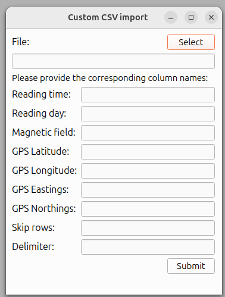

.. _sec:CustomImport:

Custom .csv
===========

The software also support processing custom, meaning files different formatted than Marine Magnetics Bob or SeaLink \verb|*.csv| files.
However, there are a couple assumptions on the \verb|*.csv| which has to be ensured by the user.
- The file has to contain in every row the same amount of columns.
- Special characters encoding a missing value or any other surprising event have to be replace with an empty string, i.e. an empty field.
- The file has to contain a header naming the columns.
A dialog, which can be spawn upon clicking on :numref:`fig:custom_scv_import_dialog` in the drop-down menu (see Fig.~\ref{fig:tree_import}), will ask for the file that is to be imported and which columns to use for what purpose.

The dialog provides an interface to the user where he can denote which names column corresponds to entity, e.g. time, longitude, etc.

.. _fig:custom_scv_import_dialog:

   The dialog provides an interface to the user where he can denote which names column corresponds to entity, e.g. time, longitude, etc.
