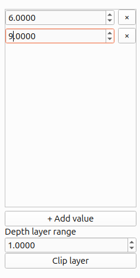
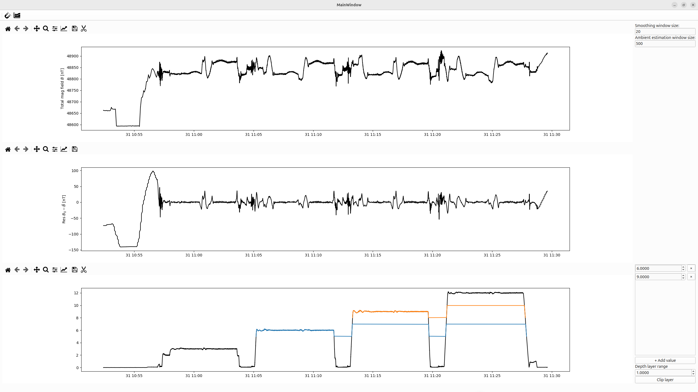

.. _sec:DepthClipping:

Time series depth clipping
==========================

Time-series data that contains a depth information (see :ref:`sec:SensysImport`) can be separated into different depth layers.
Without any depths selected the bottom plot displays the depths values for the whole time-series in black uppon clicking on ``Clip layer``.
Using this overview, the user can insert in the menu on the right-hand side (see :numref:`fig:depthClipZoom`) depths values :math:`z` (in m) and a distance :math:`\epsilon`.
This defines an interval :math:`(z-\epsilon, z+\epsilon)` which will be used to clip the region.
Or in other words, all depths values that fall within that range will be ground as a single layer.

.. _fig:depthClipZoom:

   Using ``+ Add values`` allows the insertion of an additional depth value that can also be deleted by clicking on the corresponding ``x``.

The clipped layers are displayed in different colors ontop of the full time series for the user to check (see :numref:`fig:depthClipOverview`).

.. _fig:depthClipOverview:

   The bottom plot displays the whole series in black.
   Clipped depth-layers are highlighted in color.

