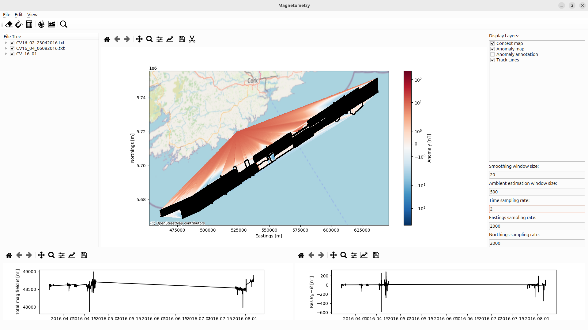
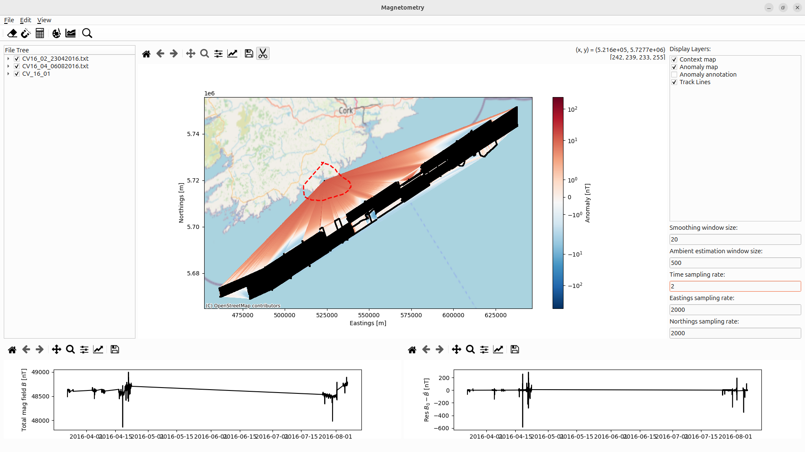
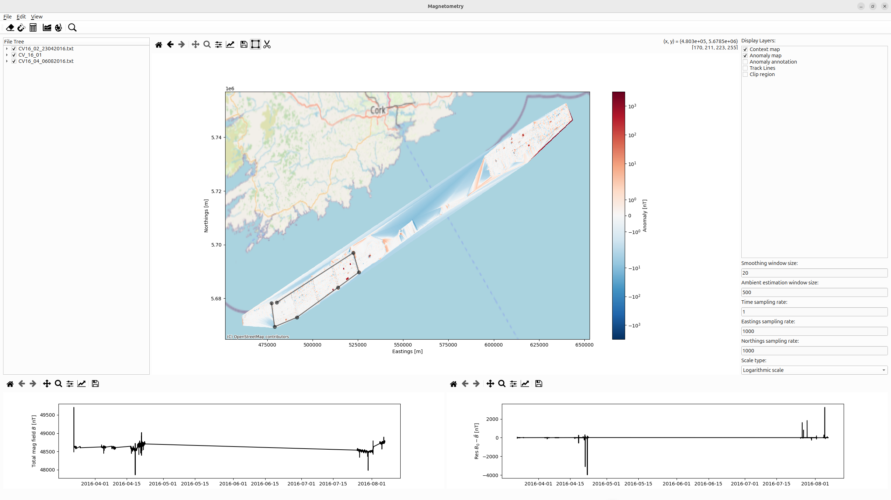
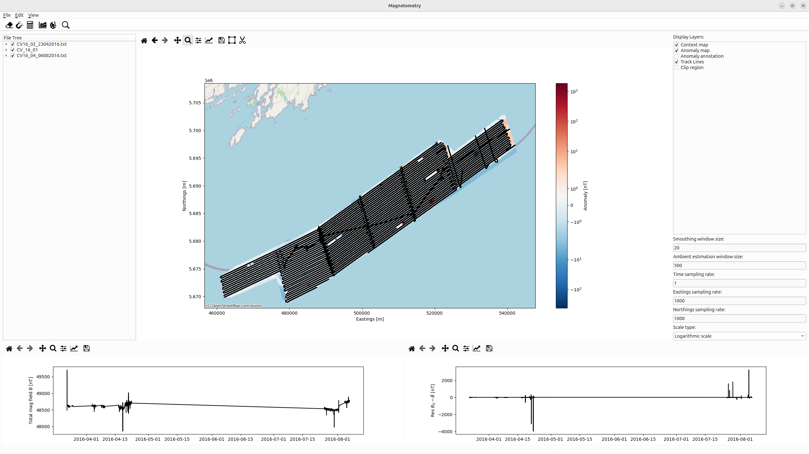

.. _sec:GridProcessing:

Anomaly grid processing
=======================

.. |draw-icon| image:: ../../_static/icons/drawingIcon.png
   :height: 1em

.. |scissor-icon| image:: ../../_static/icons/cut-scissor-icon.png
   :height: 1em

.. |select_icon| image:: ../../_static/icons/object-select-icon.png
   :height: 1em

The next step is the creation of the anomaly map.
This can be achieved upon selecting |draw-icon|.
The initial result will look similar to :numref:`fig:initialAnomaly`.

.. note::
   We note that the gridding step might take some time in particular if a high resolution is required.

Generally, the visualization can be interacted with using panning and zooming.
Additionally on the right-hand side of the main window, various layers such as the backround map or the track lines can be enabled or disabled via the checkboxes and the scale of the anomaly can be adjusted between to be either linear and logarithmic.

This is due to the fact that at the moment the software interpolates the anomaly grid within the convex hull of the given data points.

.. _fig:initialAnomaly:

   Gridding the processed time-series of ``CV_16_01``, ``CV_16_02`` and ``CV_16_04`` will interpolate an anomaly map within the convex hull of the remaining data points.
   Outliers might cause artifacts as depicted.

Outliers, such as the single point located near the coast will cause undesired artifacts as shown in :numref:`fig:initialAnomaly`.
Those can be removed using the the scissor tool |scissor-icon|.
Upon, activation the user can lasso-select an arbitrary set of points which will be removed.
The lasso is controlled by the user drawing a free-hand curve through left-clicking desired points on the map and subsequent closed upon deselecting |scissor-icon| again.
Similar to cleaning time series, the selection can be confirmed or discarded in a final dialogue.
This process is illustrated in :numref:`fig:lassoSelectAnomaly`.

.. _fig:lassoSelectAnomaly:

   Free-hand curves (red dashed line) allows selecting undesired data points to be removed.

For a more fine selection, a polynomial select tool |select_icon| is provided.

.. _fig:polySelect:

   |select_icon| allows to clip a desired region using a polygon. The clipped region will be used for further processing and export.

.. _fig:clipedRegion:

   A zoomed view on the clipped region using the |select_icon| as indicated in :numref:`fig:polySelect`.
