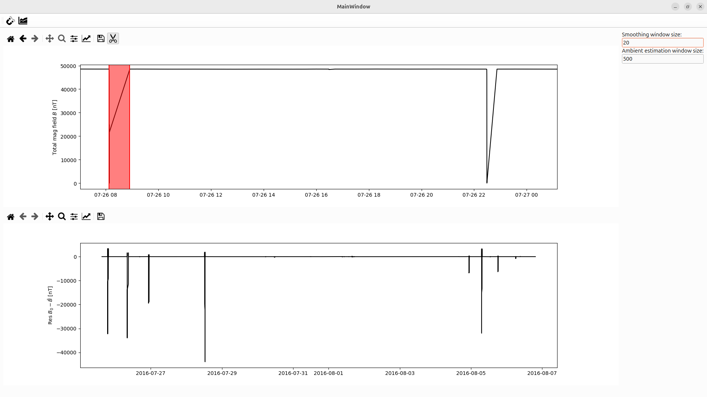

.. _sec:TimeSeriesProcessing:

Time series processing
======================

.. |scissor-icon| image:: ../../_static/icons/cut-scissor-icon.png
   :height: 1em

.. |chart-icon| image:: ../../_static/icons/area-chart-icon.png
   :height: 1em

Next, we recommend inspecting the time-series through the \enquote{timeseries}-window, which can be opened through the dropdown menu {\em view}.
The \enquote{timeseries}-window facilitates two key tasks: displaying the time-series and manipulating it.
The time series itself can be displayed by clicking on |chart-icon|.
This also replicates the time-series on the main window and vice versa if |chart-icon| is clicked on the main window.
Moreover, this operation internally smooths the time series and calculates the residuals as the difference between the ambient field, estimated as a slow running mean, and the current field, estimated as a fast running mean.
The used window size of both means is preset upon preliminary work.
However, it can be adjusted through the text fields on the right-hand sight of either the main window ot the times series window.
\begin{remark}
We note that this approach assumes a constant ambient field for the duration of the window~\cite{JOSS_paper}.
A diurnal correction using data from the Valencia observatory\footnote{\url{https://data.magie.ie/}} might be included in the future.
\end{remark}
Inside the plot, the time series could be investigated using zooming and panning.
The unprocessed time-series data might show huge negative spikes as depicted in Fig.~\ref{fig:scissorInterval}.
This is due to the fact that some raw data values are approaching $0\text{[nT]}$, probably during recovering the magnetometer.
The scissor tool |scissor-icon| is designed to remove these intervals form the time-series.
The tool can be activated by clicking on the corresponding icon.
This allows the user to select a red rectangle by moving its edges, defining the interval that is to be excluded (see Fig.\ref{fig:processedTimeSeries}).
The rectangle can be adjusted until the selection is confirmed by clicking the scissor icon again and a final dialogue will confirm the decision.
We note that at the moment the visualisation will not refresh itself automatically.
This can be achieved by clicking again on |chart-icon|.

.. _fig:scissorInterval:

   The imported raw times series might contain values approaching $0\text{[nT]}$, perturbing the calculated residuals.
   The |scissor-icon| allows to remove an interval of undesired data points, configured as red rectangle.}

