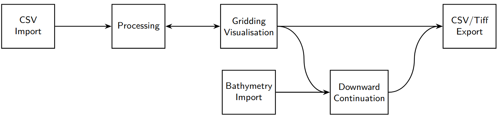

User Guide
=====

Introduction
------------

InfoMag is a user interface around the a magnetometry data processing pipeline (see :numref:`fig:pipeline`) targeted at INFOMAR's unprocessed data.
The software can either be started by cloning the repository, installing the needed packages through the provided ``requirments.txt``, compiling the cython module using the provided ``setup.py`` and running ``main_window.py`` or using the bundled executable provided for windows\footnote{Opening the executable might take some time since it needs to expand itself into a temporary folder.}.
After startup the main-window will be displayed.
This window is composed of three visualisation windows, a file tree, and configuration settings that support the user during the processing.

This guide assumes that you have downloaded the data snippet\footnote{Insert url if we get permission to upload} containing the surveys ``CV_16_01``, ``CV_16_02`` and ``CV_16_04``.
This test data will be used to guide through an example walk-through through the pipeline :numref:`fig:pipeline`.

.. _fig:pipeline:

   The software implements a processing pipeline that reads INFOMAR's magnetometry data, processes, visualizes it and eventually exports the result.
   An additional branch provides an opportunity to import bathymetry data to interpolate the downward filed at the provided altitudes.

.. toctree::
   :maxdepth: 2
   :caption: Data import

   data_import